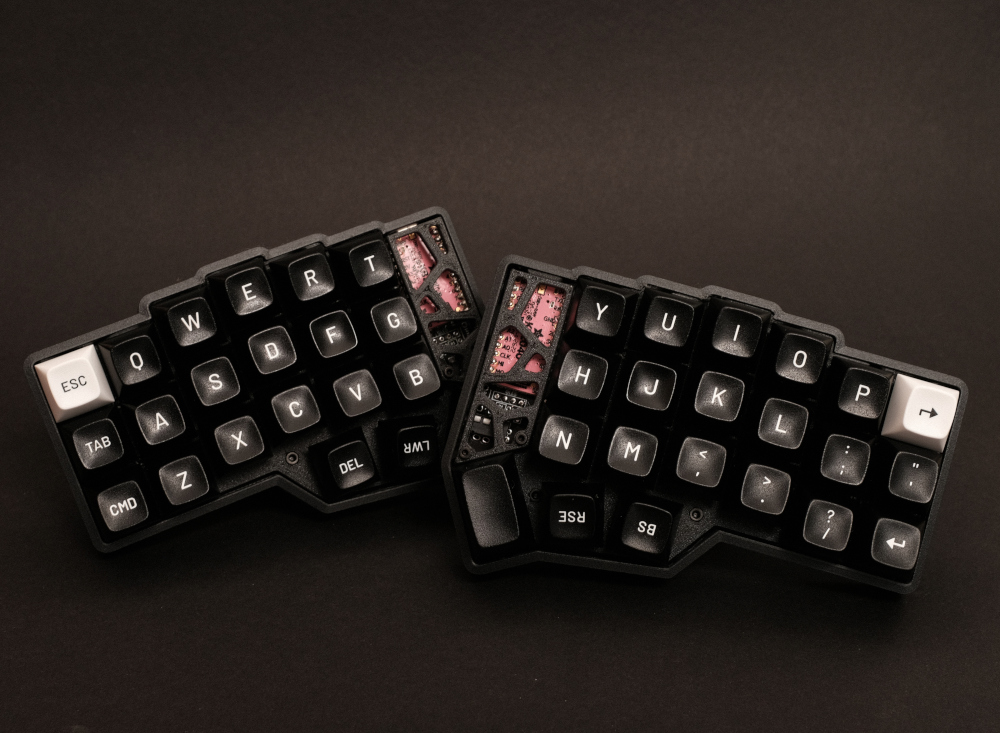
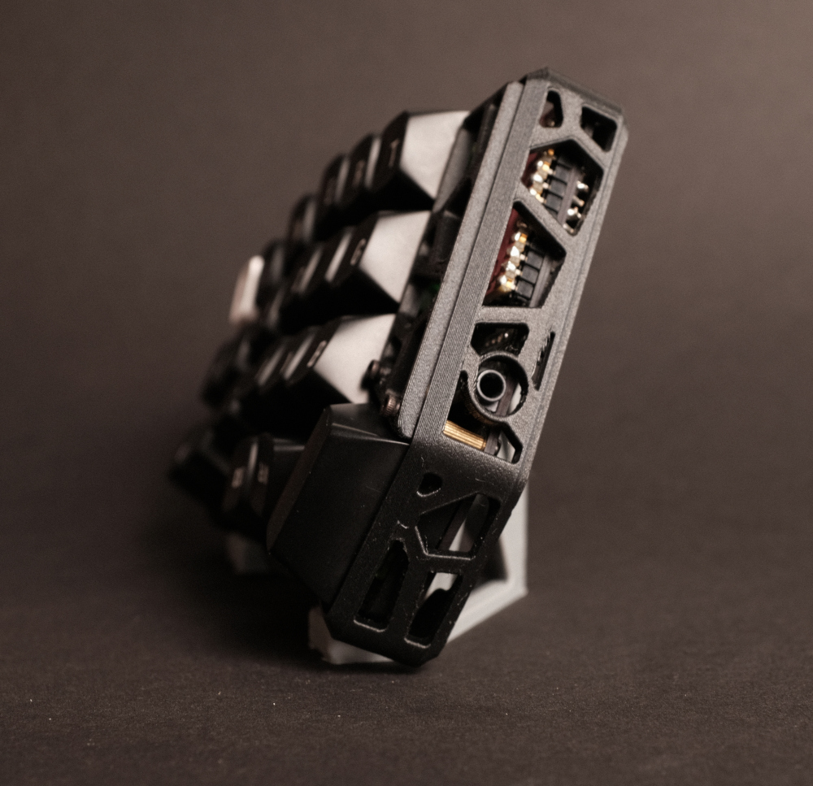
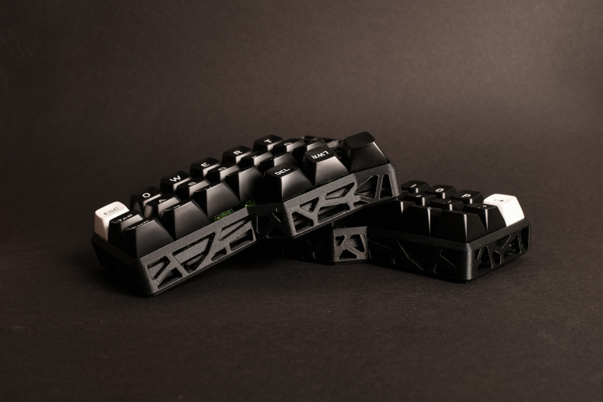
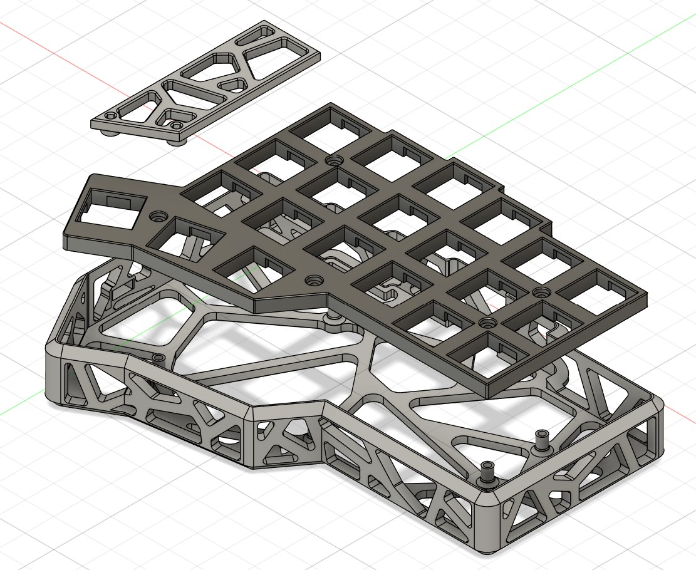

# Cornehole-case

**This is a remix of the original model to accomodate a TRRS connector and a wider variety of MCUs. Huge thanks to zzcc289 for creating this.**

A case made for [corne(crkbd)](https://github.com/foostan/crkbd), with holes. 

Inspired by [KBDfans Holy60](https://kbdfans.com/products/holy60-case). 

### Changes to the orignal design:

- I added a cutout for the TRRS connector which should be big enough to fit all TRRS cables and also slightly misaligned connectors

- The cutout for the USB-C connector is now larger and should fit most MCUs that are available. Tested with a 0xCB Helios and MCU sockets

- Edited the plates to press-fit the M2 nuts instead of smelting them in, as I had some issues with filament pushing inside of the nut and blocking the threads for the screw

## Below you find information originated from the orignal Repo

### Parts: 

### 3D Printing: 

Tree support recommended for the case. 

### Hardware: 

<table>
<tr>
        <th>Part</th>
        <th>Count</th>
        <th>Note</th>
    </tr>
    <tr>
        <td>M2 x 10 Screws</td>
        <td>10</td>
        <td>For case assembly</td>
    </tr>
    <tr>
        <td>M2 Hex Nuts</td>
        <td>10</td>
        <td>For case assembly</td>
    </tr>
    <tr>
        <td>M2 x 4 Screws</td>
        <td>4</td>
        <td>For controller cover</td>
    </tr>
    <tr>
        <td>M2 x 8 screws</td>
        <td>4</td>
        <td>For controller cover</td>
    </tr>
    <tr>
        <td>M2 x 8 female to female standoffs</td>
        <td>4</td>
        <td>For controller cover</td>
    </tr>
    <tr>
        <td>6mm x 2mm flat top round bumpon</td>
        <td>10</td>
        <td>Feet</td>
    </tr>
    
</table>

### Notes: 

- Clearance on the bottom between the case and the PCB is only 1.7mm, thus SLS printed metal case could have shorting problems.  

- To use a normal 1.5mm/1.6mm corne plate instead of the 4.5mm 3D printed plate included in this repo, standoffs on the case need to be raised by 1.7mm and M2x10 screws need to be replaced by M2x12 screws. 